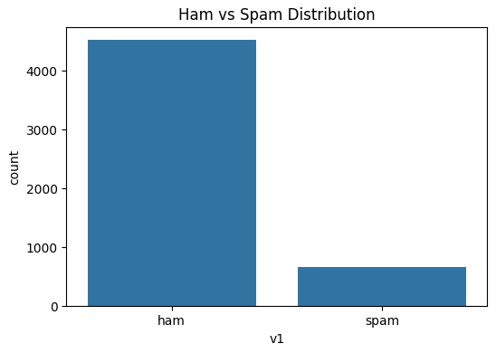
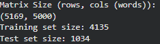
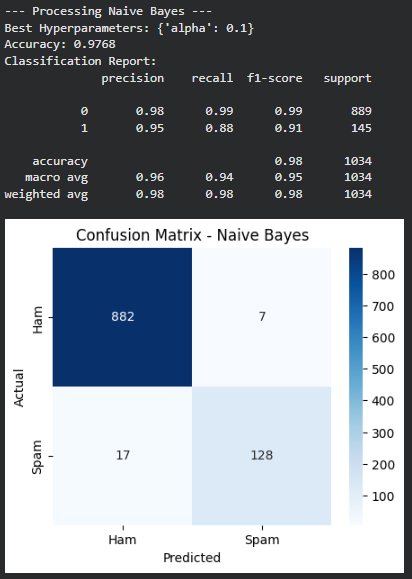
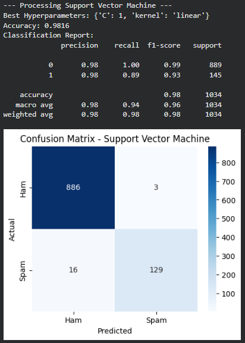

# Spam vs. Ham Email Classification

This document outlines the methodology and rationale behind implementing a Machine Learning solution to classify email messages as **Ham** (legitimate) or **Spam**.

### Dataset Structure
The dataset consists of the following columns:
* **`v1`**: Target variable (label): *'ham'* or *'spam'*.
* **`v2`**: Raw text content of the message.
* **`Unnamed: 2, 3, 4`**: Irrelevant columns containing noise/parsing errors.

---

## 1. Data Processing

**Objective:** Transform raw text data into a clean, numerical format suitable for Machine Learning algorithms.

### 1.1 Data Loading
Loaded the tabular data using `pandas` and analyzed the structure and missing values via `df.info()`.

### 1.3 Removing Irrelevant Attributes
* **Action:** Removed `Unnamed: 2, 3, 4` columns.
* **Rationale:** These columns contained mostly `NaN` values or formatting errors, adding noise without predictive value.

### 1.2 Deduplication
* **Action:** Executed `df.drop_duplicates(subset=['v2'])`.
* **Rationale:** Spam is often sent in mass batches. Removing duplicates based on text content prevents **overfitting**, ensuring the model learns from unique examples rather than memorizing repeated messages.

### 1.4 Target Encoding
* **Action:** Converted `v1` labels to binary values (0/1) using `LabelEncoder`.
* **Rationale:** ML algorithms require numerical input for loss calculation.

### 1.5 Distribution Analysis
* **Action:** Visualized class balance.
* **Rationale:** Spam datasets are typically **imbalanced** (fewer spam messages). This confirms that *Accuracy* alone is insufficient as a metric; we must also consider Precision and Recall.

### 1.6 Text Preprocessing
* **Action:** Implemented a `clean_text` function (lowercase conversion, Regex for removing punctuation/numbers).
* **Rationale:**
    * **Normalization:** Treats "Free", "free", and "FREE" as the same token.
    * **Noise Reduction:** Removes punctuation which adds unnecessary dimensionality to a "Bag of Words" model.

### 1.7 Vectorization (TF-IDF)
* **Action:** Applied `TfidfVectorizer` (max 5,000 features).
* **Rationale:** Converted text to vectors using **TF-IDF** instead of simple counts. This method penalizes common words (stop words) and weights rare, spam-indicative terms (e.g., "prize", "urgent") higher.

---

## 2. Model Training & Evaluation

### 2.1 & 2.2 Train/Test Split
* **Action:** Split data into 80% Training and 20% Testing sets.
* **Rationale:** Evaluation must be performed on unseen data to simulate real-world performance.

### 2.3 Model Selection & Optimization
We compared two algorithms using `GridSearchCV` for hyperparameter tuning:
1.  **Naive Bayes (MultinomialNB):** Industry standard for text classification.
2.  **Support Vector Machine (SVC):** Highly effective in high-dimensional spaces.

### 2.4 & 2.5 Evaluation
We prioritized the **Confusion Matrix** to analyze specific error types:
* **False Positive (FP):** Legitimate mail flagged as Spam (Critical error).
* **False Negative (FN):** Spam flagged as Legitimate.

### Naive Bayes Results:

### SVM Results:

---

## 3. Comparative Results & Conclusion

During evaluation, **SVM** proved to be the superior model, achieving an accuracy of **0.9816**, compared to **0.9768** for **Naive Bayes**.

**Final Verdict:**
We selected SVM as the final solution because it maximized accuracy while maintaining an optimal balance between *Precision* and *Recall*. As evidenced by the strong main diagonal in the confusion matrix, SVM demonstrated a robust ability to generalize, minimizing false alarms (False Positives) better than the alternative.